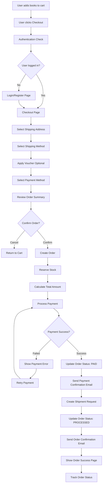
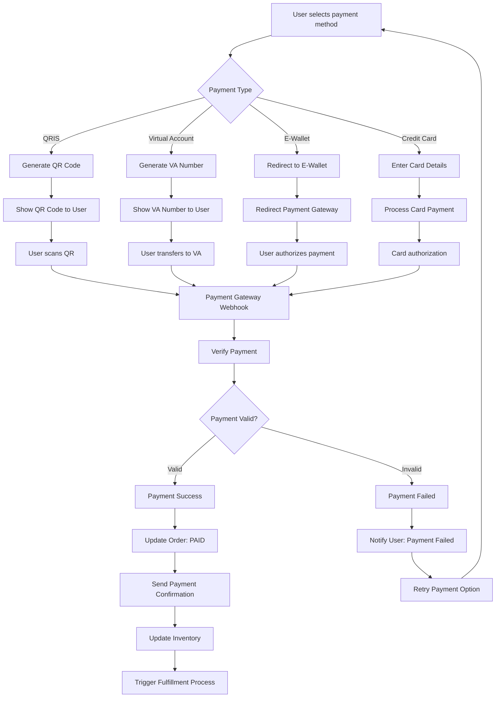
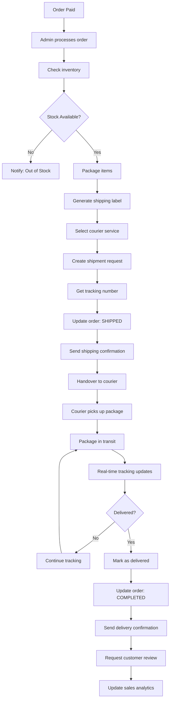
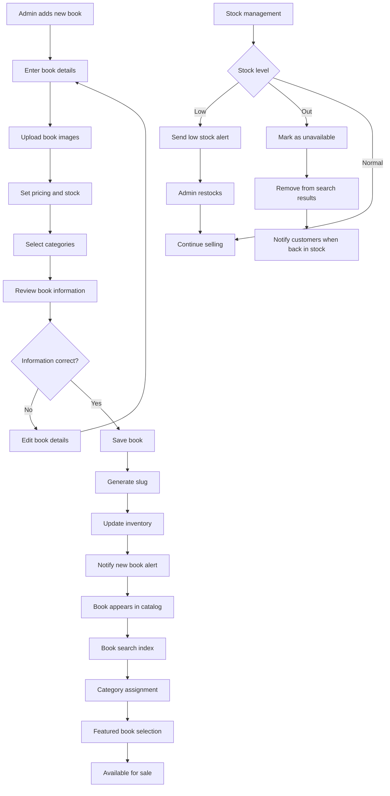
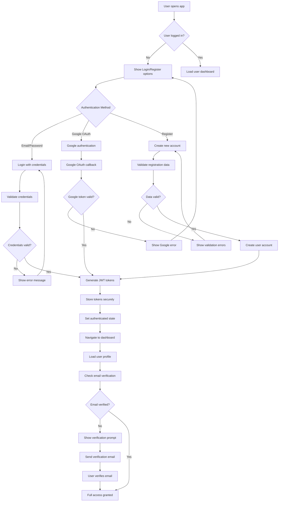
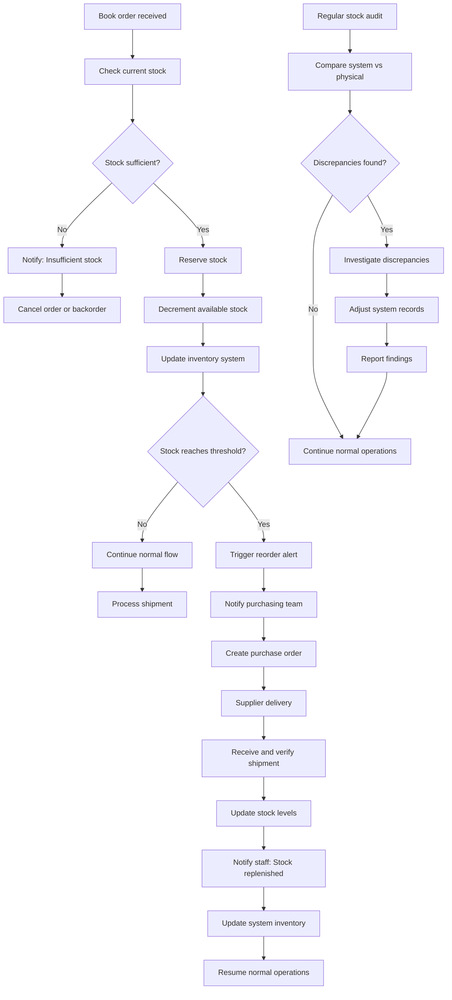
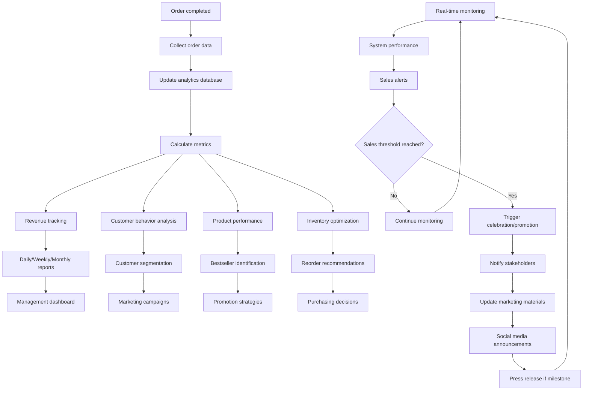
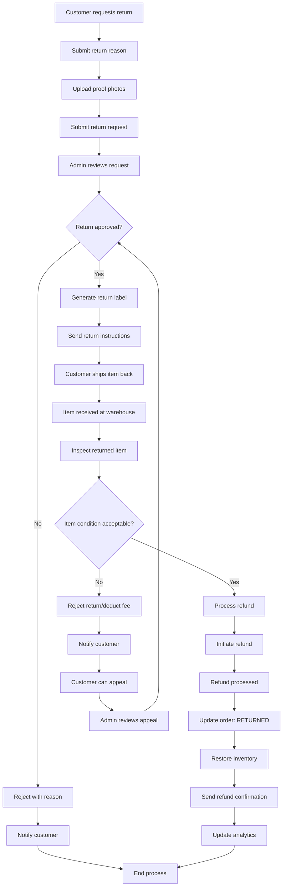
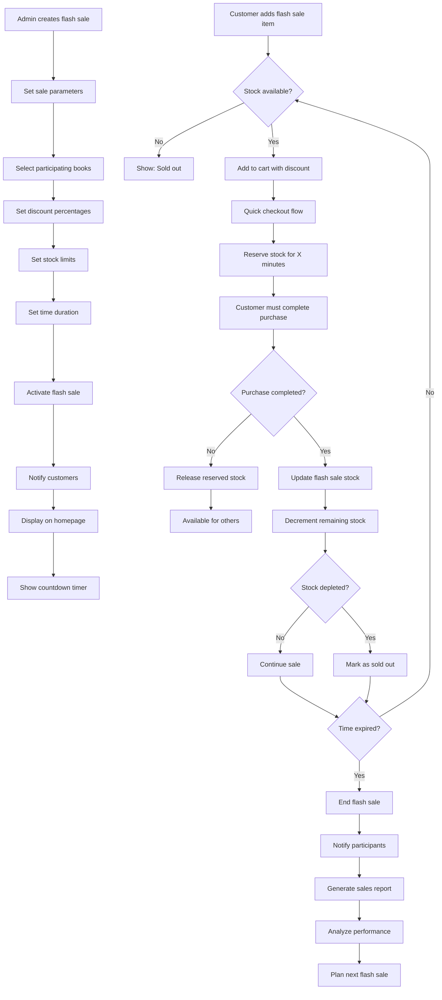

# E-Commerce Book Store - Business Flow Diagrams

## 🛒 Checkout Flow

## 💳 Payment Flow

## 🚚 Shipping Flow

## 📚 Product Management Flow

## 🔐 Authentication Flow

## 📦 Inventory Management Flow

## 📊 Order Analytics Flow

## 🔄 Return & Refund Flow

## 📈 Flash Sale Flow

These business flow diagrams provide comprehensive visual representations of all major processes in the E-Commerce Book Store platform.