# E-Commerce Book Store - Database Schema (ERD)

## Entity Relationship Diagram (Mermaid)

```mermaid
erDiagram
    users {
        uuid id PK
        string email UK
        string username UK
        string full_name
        string password_hash
        string phone
        string avatar_url
        enum role
        boolean email_verified
        boolean is_active
        timestamp created_at
        timestamp updated_at
        timestamp last_login_at
    }

    user_addresses {
        uuid id PK
        uuid user_id FK
        string label
        string recipient_name
        string phone
        string address
        string province
        string city
        string district
        string postal_code
        string coordinates
        boolean is_primary
        timestamp created_at
        timestamp updated_at
    }

    categories {
        uuid id PK
        string name
        string slug UK
        text description
        string image_url
        uuid parent_id FK
        integer sort_order
        boolean is_active
        timestamp created_at
        timestamp updated_at
    }

    books {
        uuid id PK
        string title
        string slug UK
        string subtitle
        text description
        text short_description
        string author
        string publisher
        string isbn UK
        string language
        integer publication_year
        integer pages
        decimal weight
        decimal length
        decimal width
        decimal height
        decimal price
        decimal discount_price
        integer stock
        integer sold_count
        integer view_count
        decimal average_rating
        integer review_count
        string cover_image
        json gallery_images
        boolean is_featured
        boolean is_active
        timestamp published_at
        timestamp created_at
        timestamp updated_at
    }

    book_categories {
        uuid book_id FK
        uuid category_id FK
        timestamp created_at
    }

    cart_items {
        uuid id PK
        uuid user_id FK
        uuid book_id FK
        integer quantity
        decimal unit_price
        decimal discount_price
        timestamp created_at
        timestamp updated_at
    }

    vouchers {
        uuid id PK
        string code UK
        string name
        text description
        enum type
        decimal discount_amount
        integer discount_percentage
        decimal minimum_order
        decimal maximum_discount
        integer usage_limit
        integer usage_count
        timestamp valid_from
        timestamp valid_until
        boolean is_active
        timestamp created_at
        timestamp updated_at
    }

    orders {
        uuid id PK
        string order_number UK
        uuid user_id FK
        decimal subtotal
        decimal discount_amount
        decimal shipping_cost
        decimal total_amount
        string currency
        enum status
        string payment_method
        enum payment_status
        string payment_reference
        string shipping_courier
        string tracking_number
        text shipping_address
        text notes
        timestamp ordered_at
        timestamp paid_at
        timestamp processed_at
        timestamp shipped_at
        timestamp delivered_at
        timestamp cancelled_at
        text cancellation_reason
        timestamp created_at
        timestamp updated_at
    }

    order_items {
        uuid id PK
        uuid order_id FK
        uuid book_id FK
        string book_title
        string book_isbn
        integer quantity
        decimal unit_price
        decimal discount_price
        decimal total_price
        text notes
        timestamp created_at
    }

    order_vouchers {
        uuid order_id FK
        uuid voucher_id FK
        string voucher_code
        decimal discount_amount
        timestamp created_at
    }

    payments {
        uuid id PK
        uuid order_id FK
        string payment_reference UK
        enum gateway
        enum type
        decimal amount
        enum status
        json payment_details
        string external_reference
        timestamp paid_at
        timestamp expired_at
        timestamp created_at
        timestamp updated_at
    }

    shipments {
        uuid id PK
        uuid order_id FK
        string tracking_number UK
        string courier
        string service
        decimal shipping_cost
        enum status
        text shipping_address
        json tracking_history
        timestamp shipped_at
        timestamp estimated_delivery
        timestamp delivered_at
        timestamp created_at
        timestamp updated_at
    }

    reviews {
        uuid id PK
        uuid order_id FK
        uuid book_id FK
        uuid user_id FK
        integer rating
        text comment
        json review_images
        boolean is_verified_purchase
        boolean is_helpful_count
        enum status
        timestamp created_at
        timestamp updated_at
    }

    review_helpful {
        uuid review_id FK
        uuid user_id FK
        boolean is_helpful
        timestamp created_at
    }

    banners {
        uuid id PK
        string title
        text description
        string image_url
        string redirect_url
        enum type
        integer sort_order
        boolean is_active
        timestamp starts_at
        timestamp ends_at
        timestamp created_at
        timestamp updated_at
    }

    flash_sales {
        uuid id PK
        string name
        text description
        string banner_image
        decimal discount_percentage
        timestamp starts_at
        timestamp ends_at
        integer stock_limit
        integer user_limit
        boolean is_active
        timestamp created_at
        timestamp updated_at
    }

    flash_sale_books {
        uuid flash_sale_id FK
        uuid book_id FK
        decimal original_price
        decimal sale_price
        integer available_stock
        integer sold_stock
        timestamp created_at
    }

    newsletters {
        uuid id PK
        string email UK
        string name
        boolean is_active
        boolean is_verified
        timestamp subscribed_at
        timestamp created_at
        timestamp updated_at
    }

    audit_logs {
        uuid id PK
        uuid user_id FK
        string action
        string entity_type
        uuid entity_id
        json old_values
        json new_values
        string ip_address
        string user_agent
        timestamp created_at
    }

    wishlists {
        uuid id PK
        uuid user_id FK
        uuid book_id FK
        timestamp created_at
    }

    notifications {
        uuid id PK
        uuid user_id FK
        string title
        text message
        enum type
        json data
        boolean is_read
        timestamp read_at
        timestamp created_at
    }

    payment_methods {
        uuid id PK
        string name
        string code UK
        enum type
        json config
        boolean is_active
        integer sort_order
        timestamp created_at
        timestamp updated_at
    }

    shipping_methods {
        uuid id PK
        string name
        string code UK
        string courier
        json config
        boolean is_active
        integer sort_order
        timestamp created_at
        timestamp updated_at
    }

    %% Relationships
    users ||--o{ user_addresses : "has many"
    users ||--o{ cart_items : "has many"
    users ||--o{ orders : "places"
    users ||--o{ reviews : "writes"
    users ||--o{ wishlists : "has many"
    users ||--o{ newsletters : "subscribes"
    users ||--o{ notifications : "receives"
    users ||--o{ audit_logs : "performs"

    categories ||--o{ categories : "parent-child"
    categories ||--o{ book_categories : "belongs to"

    books ||--o{ book_categories : "has many"
    books ||--o{ cart_items : "in"
    books ||--o{ order_items : "ordered"
    books ||--o{ reviews : "receives"
    books ||--o{ wishlists : "in"
    books ||--o{ flash_sale_books : "participates"

    orders ||--o{ order_items : "contains"
    orders ||--o{ order_vouchers : "uses"
    orders ||--o{ payments : "has"
    orders ||--o{ shipments : "shipped via"
    orders ||--o{ reviews : "for"

    vouchers ||--o{ order_vouchers : "used in"

    flash_sales ||--o{ flash_sale_books : "contains"

    reviews ||--o{ review_helpful : "helpful votes"

    %% Foreign Key Constraints
    users {
        uuid id PK
    }

    user_addresses {
        uuid user_id FK
    }

    categories {
        uuid parent_id FK
    }

    cart_items {
        uuid user_id FK
        uuid book_id FK
    }

    orders {
        uuid user_id FK
    }

    order_items {
        uuid order_id FK
        uuid book_id FK
    }

    order_vouchers {
        uuid order_id FK
        uuid voucher_id FK
    }

    payments {
        uuid order_id FK
    }

    shipments {
        uuid order_id FK
    }

    reviews {
        uuid order_id FK
        uuid book_id FK
        uuid user_id FK
    }

    review_helpful {
        uuid review_id FK
        uuid user_id FK
    }

    wishlists {
        uuid user_id FK
        uuid book_id FK
    }

    notifications {
        uuid user_id FK
    }

    audit_logs {
        uuid user_id FK
    }
```



## Table Definitions and Constraints

### Core Tables

#### Users
```sql
CREATE TABLE users (
    id UUID PRIMARY KEY DEFAULT gen_random_uuid(),
    email VARCHAR(255) UNIQUE NOT NULL,
    username VARCHAR(50) UNIQUE NOT NULL,
    full_name VARCHAR(255),
    password_hash VARCHAR(255) NOT NULL,
    phone VARCHAR(20),
    avatar_url TEXT,
    role user_role NOT NULL DEFAULT 'customer',
    email_verified BOOLEAN DEFAULT false,
    is_active BOOLEAN DEFAULT true,
    created_at TIMESTAMPTZ DEFAULT NOW(),
    updated_at TIMESTAMPTZ DEFAULT NOW(),
    last_login_at TIMESTAMPTZ
);

CREATE TYPE user_role AS ENUM ('admin', 'customer');
```

#### Books
```sql
CREATE TABLE books (
    id UUID PRIMARY KEY DEFAULT gen_random_uuid(),
    title VARCHAR(255) NOT NULL,
    slug VARCHAR(255) UNIQUE NOT NULL,
    subtitle VARCHAR(255),
    description TEXT,
    short_description TEXT,
    author VARCHAR(255) NOT NULL,
    publisher VARCHAR(255),
    isbn VARCHAR(20) UNIQUE,
    language VARCHAR(10) DEFAULT 'id',
    publication_year INTEGER,
    pages INTEGER,
    weight DECIMAL(8,2), -- in kg
    length DECIMAL(8,2), -- in cm
    width DECIMAL(8,2),  -- in cm
    height DECIMAL(8,2), -- in cm
    price DECIMAL(10,2) NOT NULL,
    discount_price DECIMAL(10,2),
    stock INTEGER NOT NULL DEFAULT 0,
    sold_count INTEGER DEFAULT 0,
    view_count INTEGER DEFAULT 0,
    average_rating DECIMAL(2,1) DEFAULT 0,
    review_count INTEGER DEFAULT 0,
    cover_image TEXT,
    gallery_images JSONB,
    is_featured BOOLEAN DEFAULT false,
    is_active BOOLEAN DEFAULT true,
    published_at TIMESTAMPTZ,
    created_at TIMESTAMPTZ DEFAULT NOW(),
    updated_at TIMESTAMPTZ DEFAULT NOW()
);
```

### Indexes for Performance
```sql
-- User indexes
CREATE INDEX idx_users_email ON users(email);
CREATE INDEX idx_users_role ON users(role);
CREATE INDEX idx_users_active ON users(is_active);

-- Book indexes
CREATE INDEX idx_books_title ON books USING gin(to_tsvector('english', title));
CREATE INDEX idx_books_author ON books(author);
CREATE INDEX idx_books_isbn ON books(isbn);
CREATE INDEX idx_books_price ON books(price);
CREATE INDEX idx_books_active ON books(is_active);
CREATE INDEX idx_books_published ON books(published_at);
CREATE INDEX idx_books_rating ON books(average_rating DESC);
CREATE INDEX idx_books_sold ON books(sold_count DESC);

-- Category indexes
CREATE INDEX idx_categories_parent ON categories(parent_id);
CREATE INDEX idx_categories_slug ON categories(slug);

-- Order indexes
CREATE INDEX idx_orders_user ON orders(user_id);
CREATE INDEX idx_orders_status ON orders(status);
CREATE INDEX idx_orders_created ON orders(ordered_at DESC);
CREATE INDEX idx_orders_number ON orders(order_number);

-- Review indexes
CREATE INDEX idx_reviews_book ON reviews(book_id);
CREATE INDEX idx_reviews_rating ON reviews(rating);
CREATE INDEX idx_reviews_created ON reviews(created_at DESC);
```

## Database Optimization Strategies

### 1. Partitioning
```sql
-- Partition orders by year for better performance
CREATE TABLE orders_y2024 PARTITION OF orders
FOR VALUES FROM ('2024-01-01') TO ('2025-01-01');

CREATE TABLE orders_y2025 PARTITION OF orders
FOR VALUES FROM ('2025-01-01') TO ('2026-01-01');
```

### 2. Materialized Views
```sql
-- Book statistics materialized view
CREATE MATERIALIZED VIEW book_stats AS
SELECT
    b.id,
    b.title,
    b.price,
    b.average_rating,
    b.review_count,
    b.sold_count,
    b.view_count,
    c.name as category_name
FROM books b
LEFT JOIN book_categories bc ON b.id = bc.book_id
LEFT JOIN categories c ON bc.category_id = c.id
WHERE b.is_active = true;

-- Refresh strategy
CREATE OR REPLACE FUNCTION refresh_book_stats()
RETURNS void AS $$
BEGIN
    REFRESH MATERIALIZED VIEW CONCURRENTLY book_stats;
END;
$$ LANGUAGE plpgsql;
```

### 3. Triggers for Automatic Updates
```sql
-- Update book average rating when review is added/updated
CREATE OR REPLACE FUNCTION update_book_rating()
RETURNS TRIGGER AS $$
BEGIN
    UPDATE books
    SET
        average_rating = (
            SELECT COALESCE(AVG(rating), 0)
            FROM reviews
            WHERE book_id = NEW.book_id AND status = 'approved'
        ),
        review_count = (
            SELECT COUNT(*)
            FROM reviews
            WHERE book_id = NEW.book_id AND status = 'approved'
        )
    WHERE id = NEW.book_id;

    RETURN NEW;
END;
$$ LANGUAGE plpgsql;

CREATE TRIGGER trigger_update_book_rating
    AFTER INSERT OR UPDATE ON reviews
    FOR EACH ROW
    EXECUTE FUNCTION update_book_rating();
```

This database schema provides a comprehensive foundation for the E-Commerce Book Store with proper relationships, constraints, and optimization strategies.